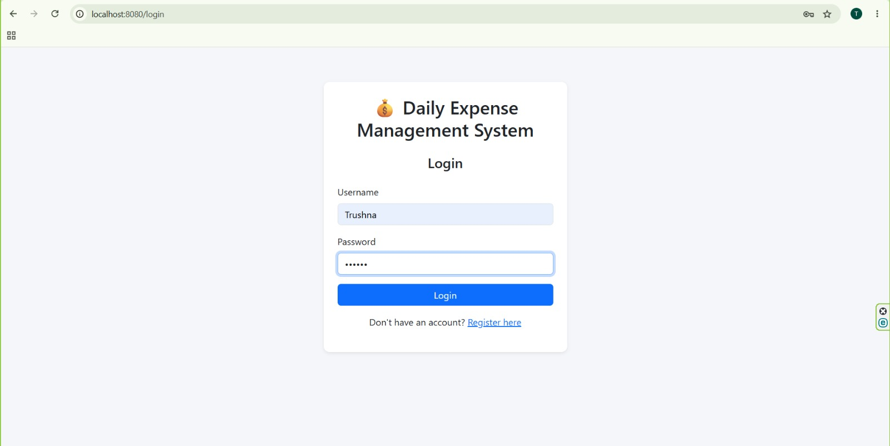
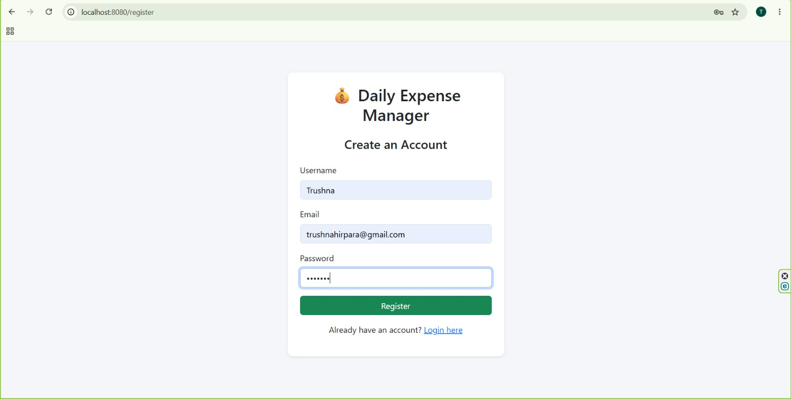
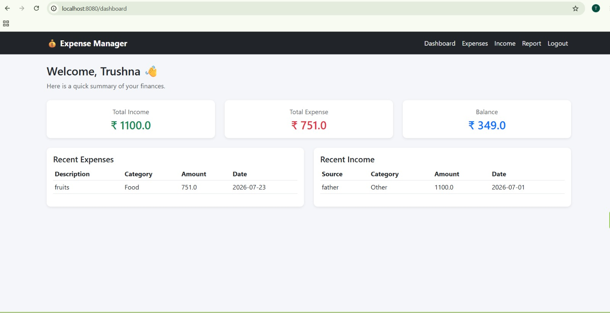
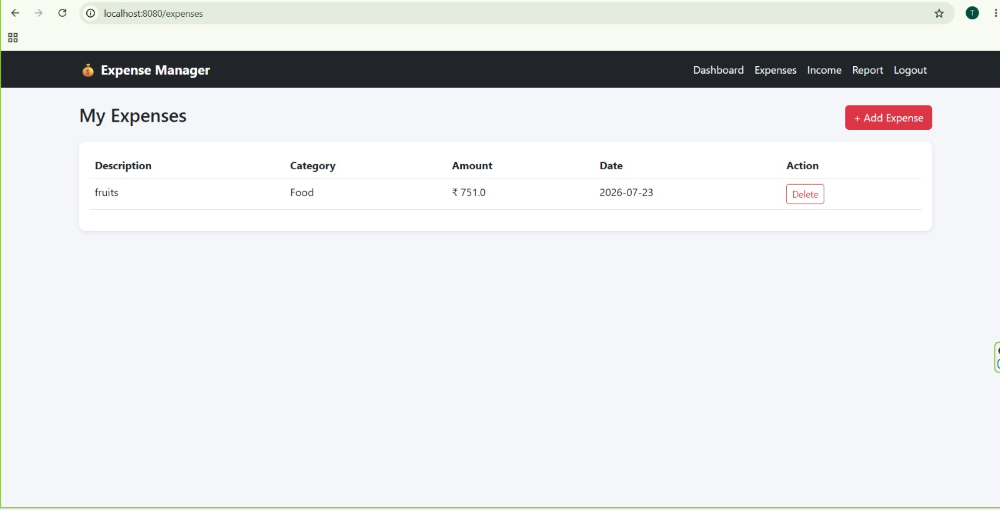
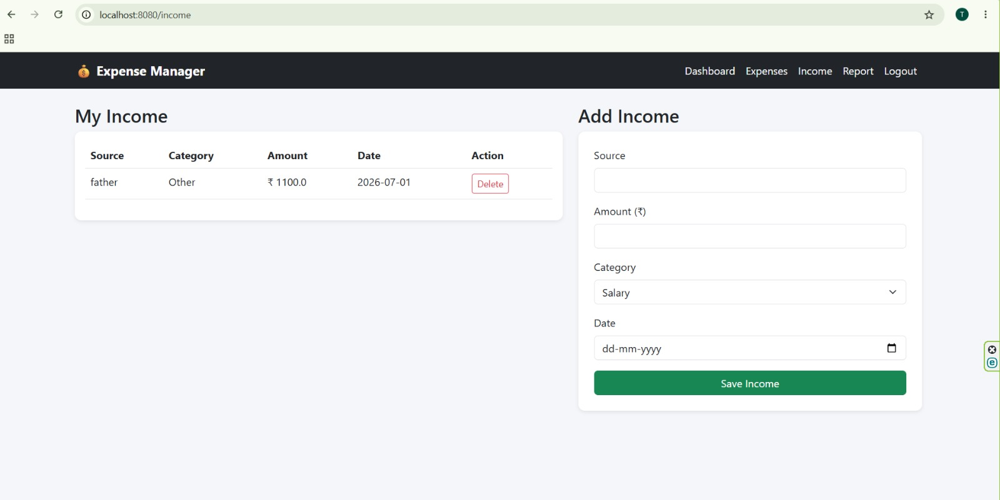
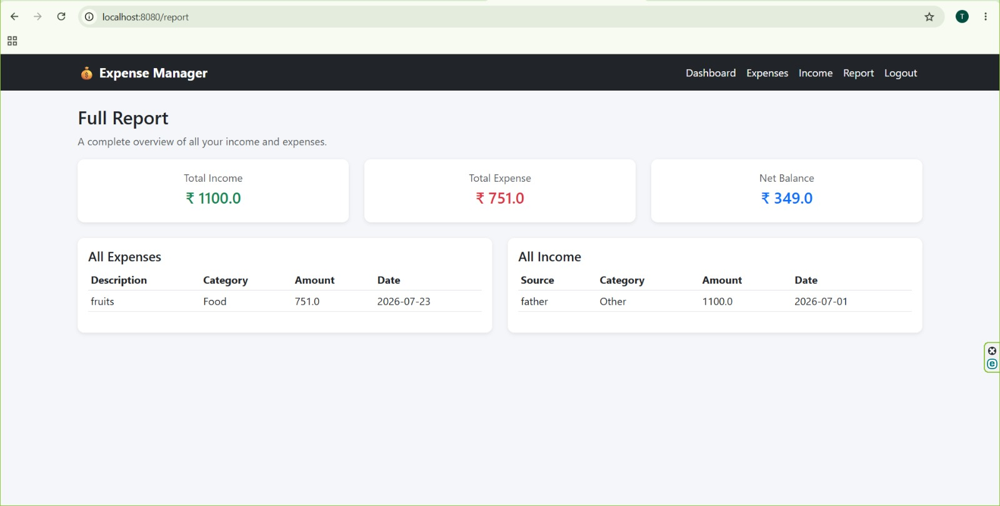

# Daily Expense Management System

A simple Spring Boot + Thymeleaf web app to track daily expenses and income.

## Tech Stack

- Java 25
- Spring Boot 3.2.5
- Spring Data JPA
- Thymeleaf
- H2 Database
- Bootstrap 5

## Project Structure
```
DailyExpenseManagement/
├── src/main/java/com/expense/dailyexpense/
│   ├── DailyExpenseManagementApplication.java   (main entry point)
│   ├── controller/    (handles web requests)
│   ├── entity/        (database tables as Java classes)
│   ├── repository/    (database access)
│   └── service/       (business logic)
├── src/main/resources/
│   ├── application.properties
│   ├── templates/     (HTML pages - Thymeleaf)
│   └── static/        (CSS/JS)
├── pom.xml
└── README.md
```

## 📋 Requirements

Install the following before running the project:

1. **Java JDK 25** (or later)  
   Download: https://adoptium.net/

2. **Apache Maven 3.9+**  
   Download: https://maven.apache.org/download.cgi

### Verify the installation

Run the following commands:

```bash
java -version
mvn -version
```

## How to Run

### Option 1: Using an IDE (easiest for beginners)
1. Unzip the project.
2. Open the folder in **IntelliJ IDEA**, **Eclipse (with Spring Tools)**, or **VS Code (with Java extensions)**.
3. Let the IDE download the Maven dependencies automatically (may take 1–2 minutes on first open).
4. Open `DailyExpenseManagementApplication.java` and click **Run**.
5. Open your browser at: **http://localhost:8080/login**

### Option 2: Using the terminal / command line
1. Unzip the project and open a terminal inside the `DailyExpenseManagement` folder.
2. Run:
   ```
   mvn spring-boot:run
   ```
   (First run downloads dependencies, so it needs an internet connection.)
3. Wait until you see:
   ```
   Daily Expense Management System Started
   Open your browser: http://localhost:8080/login
   ```
4. Open your browser at: **http://localhost:8081/login**

### Option 3: Build a runnable JAR
```
mvn clean package
java -jar target/DailyExpenseManagement-1.0.0.jar
```

## Using the App
1. Go to **/register** and create an account (username, email, password).
2. Log in at **/login**.
3. From the **Dashboard**, use the navbar to:
   - **Expenses** → view/add/delete expenses
   - **Income** → view/add/delete income
   - **Report** → see a combined summary of everything
4. Log out anytime from the navbar.

## Notes for Beginners
- The database is stored as a local file (`expensedb.mv.db`) that appears in the project folder the first time you run the app — no MySQL/Postgres installation needed.
- You can browse the database directly at **http://localhost:8081/h2-console** while the app is running.
  - JDBC URL: `jdbc:h2:file:./expensedb`
  - Username: `sa`, Password: *(leave blank)*
- Passwords are stored as plain text in this project to keep the code simple and easy to read. **Do not use this in a real production app** — in real projects, always hash passwords (e.g., with Spring Security + BCrypt).
- If port 8080 is already in use, change `server.port` in `src/main/resources/application.properties`.

## Troubleshooting
- **"mvn: command not found"** → Install Maven, or just open the project in an IDE (Option 1), which bundles Maven.
- **Port already in use** → Change `server.port=8080` to another port (e.g. `8082`) in `application.properties`.
- **Blank/broken styling** → Make sure you have an internet connection, since Bootstrap CSS loads from a CDN.
## 📸 Screenshots

### 🔐 Login


### 📝 Register


### 🏠 Dashboard


### 💸 Expense


### 💰 Income


### 📊 Report

